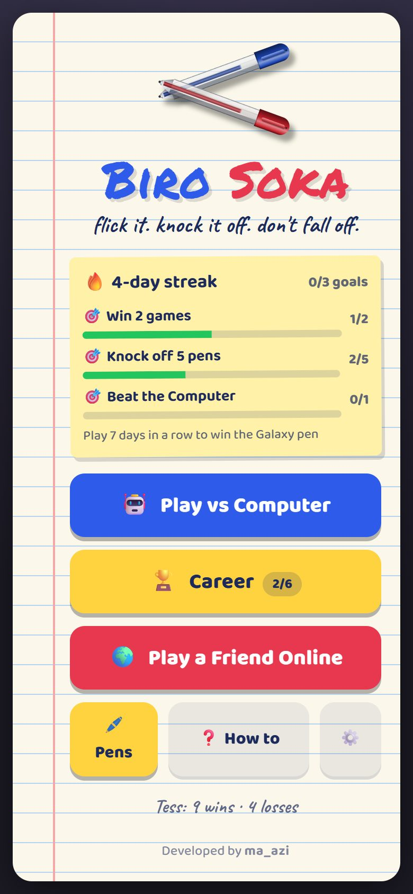
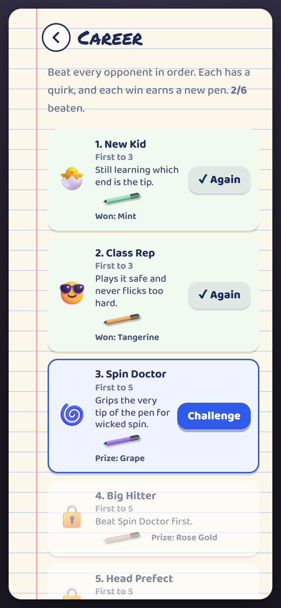
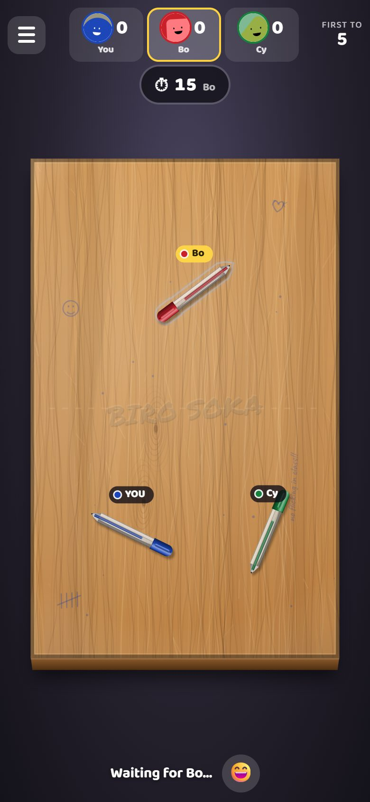

# ✏️ Biro Soka

> Flick your pen. Knock theirs off the desk. Try not to fall off yourself.

[](https://github.com/Zuka-Dev/BiroSoka/actions/workflows/ci.yml)
[](LICENSE)

Biro Soka is a top-down pen-flicking game, inspired by the schoolyard classic and by the drag-and-release feel of the
iMessage 8 Ball Pool game. It runs in any browser, is built for phones, and can be added to the home screen.

**Play it:** `<your live URL here>` &nbsp;·&nbsp; **Built by:** [ma_azi](https://github.com/Zuka-Dev)

| Home | Career ladder | Battle Royale |
|---|---|---|
|  |  |  |

## What is in it

- 🤖 **Play the Computer**: three levels, up to the Desk Champ.
- 🏆 **Career**: six named opponents, each with a quirk (the cautious Class Rep, the Spin Doctor, the all-power Big Hitter...) and a pen as the prize.
- 🌍 **Play a friend online**: share a 5-letter room code, first to 3, 5, 7 or 10. 15 seconds a turn, and the clock waits for people with bad connections.
- ⚡ **Quick match**: be paired with another player, or play the Computer if nobody is around.
- ⚔️ **Battle Royale**: 2 to 4 players on one desk, last pen standing scores.
- 🔥 **Daily goals and streaks**, 🎬 **replay of the last shot**, 📤 **share-a-win picture**, 😄 reactions and short messages (never stored).
- 🖊️ Cosmetic **pens and desks** to unlock. Nothing you can buy or earn changes how the game plays.
- Everything is made with code: the art is drawn on a canvas, the sound effects and music are generated live, and the avatars come from [Boring Avatars](https://boringavatars.com/). There are no image or audio files to download.

## Run it on your computer

You need [Node.js](https://nodejs.org/) 20 or newer.

```bash
git clone https://github.com/Zuka-Dev/BiroSoka.git
cd BiroSoka
npm install
npm run dev
```

Open <http://localhost:5173>. To try it on your phone, use the "Network" address Vite prints (your phone must be on the
same Wi-Fi). To test multiplayer by yourself, open a second window in a private/incognito window.

| Command | What it does |
|---|---|
| `npm run dev` | Server (port 3001) and client (port 5173) with live reload |
| `npm run build` | Build the app into `client/dist` |
| `npm start` | Serve the built app and the multiplayer server together (port 3001) |
| `npm run typecheck` | Type-check everything |
| `npm test` | Rules, physics, AI, replay, and a real server with real connections |

## How it works

- **One physics, everywhere.** The rules and physics ([planck.js](https://github.com/piqnt/planck)) live in `shared/` and run in the browser *and* on the server with a fixed time step, so the same flick always gives the same result.
- **The server is the referee.** In online games each flick is sent to the server, which replays it itself, scores it and tells everyone. Players cannot cheat, and each device only has to animate the result.
- **Replays are free.** Because the physics is deterministic, a replay is just the same shot simulated again from the saved starting positions.
- **The Computer thinks in a web worker.** It tries many shots in the real physics and picks the best, so the table never freezes.
- **No database, no accounts.** Rooms live in the server's memory; your name, pens and progress stay in your browser.

## Project layout

```
shared/   Game rules, physics, AI, scoring, career and goals. Runs on both client and server.
client/   The React app (Vite): game/ (canvas table), screens/, components/, lib/
server/   Node + Express + Socket.IO: rooms, referee, matchmaking, turn clock
docs/     Maintainer guide and screenshots
```

Tuning knobs for how the game *feels* are all in [`shared/src/config.ts`](shared/src/config.ts).

## Want to help?

Yes please! Read **[CONTRIBUTING.md](CONTRIBUTING.md)** to get started. Good first jobs: new pens and desks, funny lines for
the commentary, new Career opponents, tests, and accessibility improvements. Everyone is welcome under our
[Code of Conduct](CODE_OF_CONDUCT.md).

- Deploying your own copy: [DEPLOY.md](DEPLOY.md)
- Running the project as a maintainer: [docs/MAINTAINING.md](docs/MAINTAINING.md)
- Found a security problem? [SECURITY.md](SECURITY.md)

## Credits and licences

Biro Soka is released under the [MIT License](LICENSE), copyright ma_azi. It is built on these open-source projects:

| Project | Used for | Licence |
|---|---|---|
| [React](https://react.dev/) | The interface | MIT |
| [planck.js](https://github.com/piqnt/planck) | 2D physics | MIT |
| [Socket.IO](https://socket.io/) | Real-time multiplayer | MIT |
| [Express](https://expressjs.com/) | The web server | MIT |
| [Boring Avatars](https://boringavatars.com/) | Player avatars | MIT |
| [Vite](https://vite.dev/), [tsx](https://github.com/privatenumber/tsx), [concurrently](https://github.com/open-cli-tools/concurrently) | Build and dev tools | MIT |
| [TypeScript](https://www.typescriptlang.org/) | The language | Apache-2.0 |
| [Baloo 2](https://fonts.google.com/specimen/Baloo+2), [Caveat](https://fonts.google.com/specimen/Caveat) | Fonts (loaded from Google Fonts) | SIL OFL |
| [Permanent Marker](https://fonts.google.com/specimen/Permanent+Marker) | Font (loaded from Google Fonts) | Apache-2.0 |
